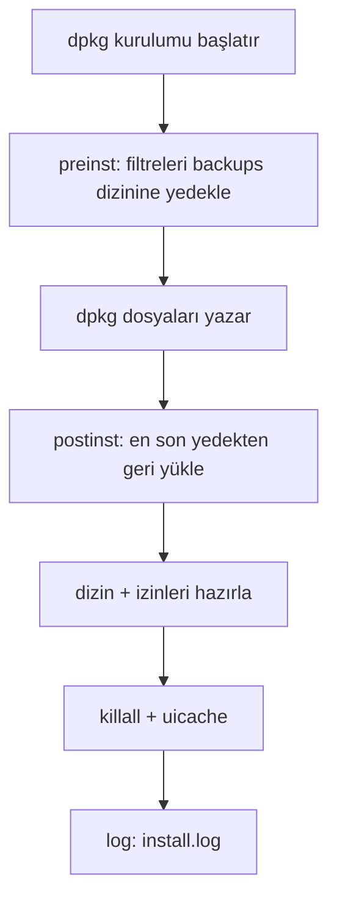

# iGameGod 0.8.9.2 Paket Analizi

`upstream/*.deb`'in `scripts/extract.sh` ile açılmasıyla elde edilen bulgular.
Tarih: 2026-09-09. Araç: `dpkg-deb`, `ar`, `tar`, `python3` (plist çözümleme).

## 1. Paket kimliği

| Alan | Değer |
|---|---|
| Package | `com.gamegod.igg` |
| Name | iGameGod |
| Version (upstream) | 0.8.9.2 |
| Architecture | iphoneos-arm (rootful) |
| Section | Utilities |
| Depends | `mobilesubstrate (>= 0.9.5000), ldid, fakeroot, odcctools` |
| Installed-Size | 35372 KB (~35 MB) |
| Arşiv biçimi | `debian-binary` + `control.tar.gz` + `data.tar.lzma` (klasik Cydia uyumlu) |
| Sahiplik | root:wheel (0:0) |

## 2. Bileşen haritası

| Yol | Ne işe yarar | Boyut |
|---|---|---|
| `Applications/iGameGod.app/iGameGod` | Ana uygulama binary'si (ince Mach-O arm64) | 1.1 MB |
| `Applications/iGameGod.app/bin/` | Yardımcı araçlar: `flexdecrypt`, `fouldecrypt` (+3 varyant: `.kernrw/.krw/.tfp0`), `ldid`, `otool`, `install_name_tool` | ~9 MB |
| `Applications/iGameGod.app/SharedFrameworks/libloader.dylib` | Gömülü loader (tweak enjeksiyonu için) | 152 KB |
| `Applications/iGameGod.app/lib{krw,kernrw}.0.dylib` | Kernel R/W yardımcı kitaplıkları | ~300 KB |
| `Library/Frameworks/iGameGod.framework/iGameGod` | Asıl motor: Swift ile yazılmış overlay + araçlar (ince Mach-O arm64) | 22 MB |
| `Library/Frameworks/iGameGod.framework/Headers/` | Genel header'lar: `iGameGod-Swift.h` (1405 satır), `AppCleaner.h` | ~76 KB |
| `Library/Frameworks/iGameGod.framework/Modules/` | Swift modül + `module.modulemap` | ~2 MB |
| `Library/MobileSubstrate/DynamicLibraries/iGameGodLoader.dylib` | Substrate loader: `config.plist`'i okur, framework'ü hedef uygulamaya yükler | 152 KB |
| `.../iGameGodLoader.plist` | Symlink → `../../../var/mobile/Library/iGameGod/substrate.plist` | — |
| `.../iGSpoof.dylib` + `.plist` | Kimlik sahtecilik (spoof) eklentisi | 72 KB |
| `.../bfdecrypttweak.dylib` + `.plist` | Uygulama şifre çözme (decrypt) eklentisi | 112 KB |
| `usr/local/bin/cmnd` | Setuid kök yardımcısı (`postinst` ile 6775 yapılır, fat binary) | 168 KB |
| `var/mobile/Library/iGameGod/substrate.plist` | Loader filtre listesi (uygulamada seçilen paketler; varsayılan boş) | 67 B |

## 3. Binary türleri

`cffaedfe` = ince Mach-O 64-bit (arm64), `cafebabe` = fat/universal.

| Binary | Sihir | Not |
|---|---|---|
| `iGameGod` (app) | cffaedfe | ana uygulama |
| `iGameGod.framework/iGameGod` | cffaedfe | motor (en büyük parça) |
| `iGameGodLoader.dylib`, `iGSpoof.dylib`, `bfdecrypttweak.dylib`, `libloader.dylib`, `ldid` | cffaedfe | ince arm64 |
| `cmnd`, `flexdecrypt`, `libkrw.0.dylib` | cafebabe | fat (çok mimarili) |

## 4. Derleme bulguları (Info.plist)

- `CFBundleIdentifier`: `com.gamegod.igg` (app), `com.gamegod.iGameGod` (framework)
- `MinimumOSVersion`: **13.0**, `UIDeviceFamily`: iPhone + iPad
- URL şeması: `gamegodopen://` (`com.gamegod.igg.open`)
- Kısayollar: "Install .deb Package", "iGameGod Installed Tweaks", "iGDecrypt", "iGSpoof"
- SDK: iphoneos26.2, DTXcode 2630 (güncel toolchain ile derlenmiş)
- Belge/dosya paylaşımı açık (`UIFileSharingEnabled`), çok sayıda dosya türü kayıtlı
  (pdf, zip/rar/7z, epub, office, medya...) — dahili dosya yöneticisi için.

## 5. Orijinal kurulum scriptleri

| Script | Davranış |
|---|---|
| `preinst` | `bfdecrypttweak/iGSpoof` filtrelerini + loader filtresini **`/tmp`'ye** kopyalar (tek slot, reboot'ta kaybolur) |
| `postinst` | `/tmp`'den geri yükler; `Documents/Decrypted` + `Library/iGameGod` (+`Frameworks/iGameGod`) dizinlerini 777 yapar; `cmnd`'ye 6775 verir; `killall iGameGod`; `uicache` (korumasız çağrı) |
| `prerm` | **boş** (yalnızca shebang) |
| `postrm` | Bilgi mesajı (".deb enjeksiyonu durur" uyarısı) |

Zayıflıklar: `/tmp` yedeği dayanıksız; `killall`/`uicache` yoksa hata verir;
günlük tutulmaz; rootless (`/var/jb`) desteği yok. Bu repo hepsini giderir
(bkz. `OZELLIKLER.md`).

## 6. Filtre plist'leri (çözümlenmiş)

- `substrate.plist` → `{Filter: {Bundles: []}}` (kullanıcı uygulamada doldurur)
- `iGSpoof.plist` → `{Filter: {Bundles: []}}`
- `bfdecrypttweak.plist` → `{Filter: {Bundles: ['']}}`
- `iGameGodLoader.plist` deb içinde **symlink**'tir (hedef: paylaşılan `substrate.plist`).

## 7. Header API özeti (tweak geliştirme için)

`iGameGod-Swift.h`: **138 `@interface`** bildirimi. Mimari desen:

- `OverlayViewController : UIViewController` — tüm araç pencerelerinin tabanı
  (arama, favoriler, kitaplık tarayıcı, yığın izleme, ayarlar...).
- `HoverControlContainerViewController` — disassembler, dosya tarayıcı, hız
  hilesi, dokunuş kaydedici gibi "hover" araçlarının tabanı.
- Kilit sınıflar: `GameGod` (`+embedGameGod`, `+showGameGod`,
  `+prepareResourceBundle`, `+prepareTemporaryStorage`), `GameGodWindow`
  (`-sendEvent:`, `-hitTest:`...), `GGSpeedManager` (`+sharedManager`),
  `GGUpdateManager` (`+setCurrentVersion:`), `HoverButtonViewController`.
- `AppCleaner.h` (C API): `IGGAppCleanerWipeAppData`,
  `IGGAppCleanerInstallSpoofHooks`, `...InstallLifecycleCleanupObservers`,
  `...Mark/ResetSpoofedIDs...`, `...RunPendingWipeOnLaunchIfNeeded`.

`tweak/Tweak.x` bu listeden doğrulanan 3 metodu örnek olarak hook'lar.

## 8. Loader bulguları (string taraması)

`iGameGodLoader.dylib` içinde geçen dikkat çekici dizgiler:

- Yapılandırma yolu: `/var/mobile/Library/iGameGod/config.plist`
  ("Unable to read the iGameGod configuration. Open iGameGod and save your
  app selections again." — hata mesajı)
- Arama yolları: `/Library/Frameworks/iGameGod/`, `/Library/Frameworks/`,
  `/Applications/iGameGod.app/Frameworks/`, `Frameworks/iGameGod.framework`
- "Loaded embedded iGameGod.framework via signer fallback for ..." — gömülü
  framework'e imza yedeğiyle yükleme mantığı mevcut.

## 9. Kurulum akışı (bu repo ile)

## 10. Bilinen sınırlamalar

1. Upstream yalnızca **rootful** dağıtır; rootless varyant bu repo tarafından
   üretilir ve cihazda test edilmelidir (loader içindeki mutlak `/Library`
   yolları için bkz. `OZELLIKLER.md`).
2. `cmnd` setuid yardımcısının kaynağı yoktur; yalnızca paketlenir ve
   `postinst` ile yetkilendirilir.
3. Binary'ler kapalı kaynaktır; yeni **uygulama-içi** özellikler ancak
   `tweak/` desenindeki companion tweak'lerle eklenebilir.

## 11. Reklam SDK'si bulgulari (StartApp)

`strings` taramasiyla framework icinde **StartApp (start.io) SDK** izleri bulundu:

- `StartAppProvider`, `BannerAdConfig` / `BannerAdController`,
  `InterstitialAdConfig` / `InterstitialAdController` (Swift sembol adlari)
- `window.startappad.closeSplash` (splash reklam kapatma koprusu)
- `addStartAppParamsToURL:` (isteklere reklam parametresi ekleme)
- `adMobAdapterVersion` (AdMob mediation bagdastiricisi dizgisi)
- 9 adet takip-API dizgisi (`advertisingIdentifier`, `ASIdentifierManager`,
  `requestTrackingAuthorization`, ...)

Info.plist'te `GADApplicationIdentifier` / `SKAdNetworkItems` yok; AdMob
dogrudan degil, varsa StartApp mediation uzerinden devrede. iGameGod'un kendi
modulunde (`iGameGod-Swift.h`) reklam sinifi yok: SDK statik bagli ve siniflar
yalnizca calisma aninda ObjC runtime'da gorunur. Bu yuzden reklam engelleme,
`tweak/` icindeki companion ile calisma-ani sinif adi eslesmesiyle yapilir
(bkz. `OZELLIKLER.md` F9). Binary'ye yama yapilmaz; orijinal paket aynen korunur.

Not: `AdjustCfaOffsetEx` gibi attribution (olcümleme) SDK izleri de goruldu;
gorunur reklam gostermedikleri icin engelleme kapsami disinda birakildi.

## 12. Derleme ortami izleri

Framework dizgileri arasinda Rust crate yollari var:
`/Users/runner/.cargo/registry/...` (`dashmap`, `hashbrown`, `once_cell`,
`parking_lot`, `smallvec`, `oslog`). `/Users/runner` yolu, upstream'in
GitHub Actions `macos` runner'larinda derlendigini gosterir (projenin bir
kismi Rust iceriyor).
